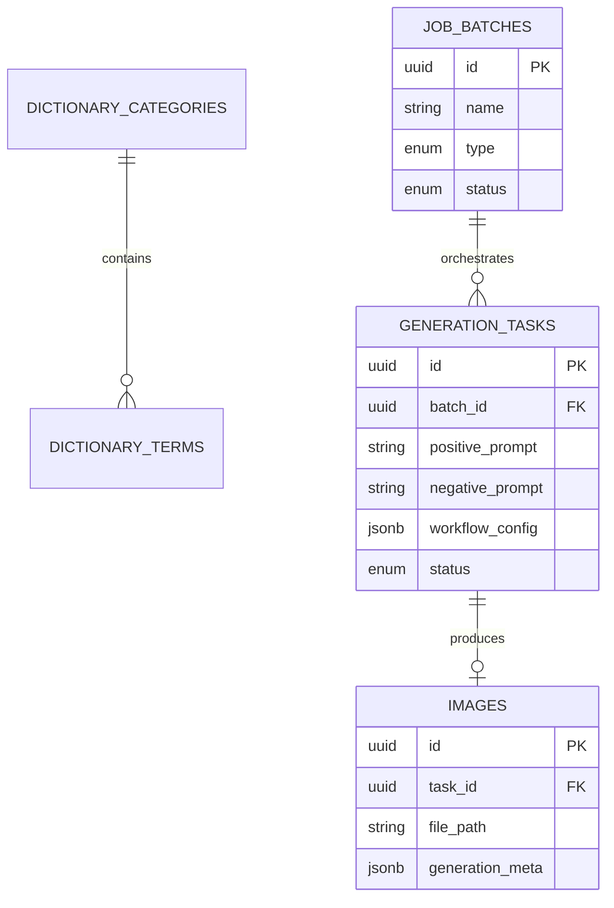

# Database & Schema Product Requirements Document (PRD)

## 1. Executive Summary

As the **AI Studio** transitions from a local CLI automation script to a professional, scalable web application, the underlying data architecture must evolve from flat files (`.csv`, `.json`) and directory scraping into a robust, queryable database system.

This PRD outlines the architecture, schema, and implementation strategy for the database layer, utilizing **PostgreSQL** as the primary relational data store and **Redis** for high-speed queuing, state management, and real-time Pub/Sub brokering.

---

## 2. Architectural Philosophy & Technology Stack

### 2.1 Technology Stack

- **Primary Database:** PostgreSQL 15+ (Ideal for complex queries, relational integrity, and JSONB support for dynamic AI parameters).
- **In-Memory Store / Queue:** Redis 7+ (Ideal for task queuing, caching dictionary dropdowns, and WebSocket Pub/Sub).
- **ORM (Backend Integration):** SQLAlchemy 2.0 (Python/FastAPI) utilizing the Repository Pattern.
- **Migrations:** Alembic (for safe, version-controlled schema changes).

### 2.2 Design Principles

- **Modularity & Flexibility:** ComfyUI workflow definitions change frequently. While core concepts (Prompt, Seed) get dedicated columns, complex workflow data will be stored in PostgreSQL `JSONB` columns to prevent constant schema migrations.
- **UUIDs Everywhere:** Primary keys will use UUIDv4 to obscure sequential counts, ensure uniqueness across distributed systems, and allow offline ID generation.
- **Soft Deletion:** Records (especially Batch Jobs and Gallery Images) will use soft-deletes (`deleted_at` timestamps) to preserve historical data without cluttering the UI.
- **Data Normalization:** Dictionaries and Templates will be normalized to allow easy UI updates without bulk-editing text files.

---

## 3. PostgreSQL Relational Schema

The relational schema is divided into three core domains: **Configuration** (Dictionaries/Templates), **Orchestration** (Jobs/Batches), and **Assets** (Images).

### 3.1 Domain 1: Configuration (Dictionaries & Templates)

Replaces `dictionaries.json` and static templates, allowing the Next.js UI to fetch and edit these dynamically.

**Table: `dictionary_categories`**
| Column Name | Type | Constraints | Description |
| :--- | :--- | :--- | :--- |
| `id` | UUID | PK | Unique identifier |
| `name` | VARCHAR(50) | UNIQUE, NOT NULL | e.g., 'ARTIST', 'CHARACTER', 'PLACE' |
| `created_at` | TIMESTAMPTZ | DEFAULT NOW() | |

**Table: `dictionary_terms`**
| Column Name | Type | Constraints | Description |
| :--- | :--- | :--- | :--- |
| `id` | UUID | PK | Unique identifier |
| `category_id` | UUID | FK -> dictionary_categories(id) | Maps term to category |
| `term` | VARCHAR(255)| NOT NULL | e.g., 'Asuna (SAO)', '@wlop' |
| `is_active` | BOOLEAN | DEFAULT TRUE | Allows disabling terms without deletion |

**Table: `dynamic_templates`**
| Column Name | Type | Constraints | Description |
| :--- | :--- | :--- | :--- |
| `id` | UUID | PK | Unique identifier |
| `name` | VARCHAR(100)| NOT NULL | e.g., 'Standard 1Girl Portrait' |
| `template_string`| TEXT | NOT NULL | e.g., '1girl, {CHARACTER}, {ARTIST}...' |
| `created_at` | TIMESTAMPTZ | DEFAULT NOW() | |

### 3.2 Domain 2: Orchestration (Batches & Tasks)

Replaces `jobs.csv` and handles the execution state of the system.

**Table: `job_batches`**
Groups multiple generations together (e.g., a CSV upload or a Dynamic run of 50 images).
| Column Name | Type | Constraints | Description |
| :--- | :--- | :--- | :--- |
| `id` | UUID | PK | Unique identifier |
| `name` | VARCHAR(255)| NOT NULL | e.g., 'Dynamic Batch - Nov 12' |
| `type` | ENUM | NOT NULL | 'MANUAL', 'CSV', 'DYNAMIC' |
| `status` | ENUM | NOT NULL | 'PENDING', 'PROCESSING', 'COMPLETED', 'FAILED' |
| `total_tasks` | INTEGER | NOT NULL | Number of total images requested |
| `created_at` | TIMESTAMPTZ | DEFAULT NOW() | |

**Table: `generation_tasks`**
Represents a single request to ComfyUI.
| Column Name | Type | Constraints | Description |
| :--- | :--- | :--- | :--- |
| `id` | UUID | PK | Unique identifier (maps to ComfyUI prompt_id) |
| `batch_id` | UUID | FK -> job_batches(id) | Nullable (for one-off manual jobs) |
| `status` | ENUM | NOT NULL | 'QUEUED', 'EXECUTING', 'DONE', 'ERROR' |
| `positive_prompt`| TEXT | NOT NULL | Fully synthesized positive prompt |
| `negative_prompt`| TEXT | NOT NULL | Fully synthesized negative prompt |
| `width` | INTEGER | NOT NULL | e.g., 1024 |
| `height` | INTEGER | NOT NULL | e.g., 1024 |
| `seed` | BIGINT | NULL | The specific seed used |
| `workflow_config`| JSONB | NOT NULL | The exact JSON dict payload sent to ComfyUI |
| `created_at` | TIMESTAMPTZ | DEFAULT NOW() | |
| `completed_at` | TIMESTAMPTZ | NULL | Timestamp of finalization |

### 3.3 Domain 3: Assets (Gallery & Vault)

Replaces direct file system scraping, enabling pagination, filtering, and metadata inspection in the UI.

**Table: `images`**
| Column Name | Type | Constraints | Description |
| :--- | :--- | :--- | :--- |
| `id` | UUID | PK | Unique identifier |
| `task_id` | UUID | FK -> generation_tasks(id) | Links image to its generation params |
| `file_path` | VARCHAR(500)| NOT NULL | Relative path (e.g., '/outputs/img_01.png') |
| `file_size_kb` | INTEGER | NULL | Useful for storage metrics |
| `generation_meta`| JSONB | NULL | Denormalized snapshot of Seed, Model, Prompts |
| `is_favorited` | BOOLEAN | DEFAULT FALSE | For Gallery curation |
| `created_at` | TIMESTAMPTZ | DEFAULT NOW() | |
| `deleted_at` | TIMESTAMPTZ | NULL | Soft delete flag |

---

## 4. Redis Architecture (In-Memory & Queues)

Redis will handle high-frequency reads, execution queuing, and websocket relaying to prevent locking up PostgreSQL and ensure maximum throughput.

### 4.1 Job Queuing System

- **Key:** `queue:generation:pending` (List)
  - **Value:** JSON string of the `generation_task.id`.
  - **Usage:** FastAPI background tasks `BLPOP` (blocking pop) from this list to send tasks one by one to ComfyUI, ensuring the local GPU isn't overwhelmed.
- **Key:** `queue:generation:active` (Hash)
  - **Value:** `task_id` -> `timestamp_started`.
  - **Usage:** Tracks what is currently running on the AI Engine. If a task sits here too long, a watchdog worker can flag it as 'FAILED'.

### 4.2 State & Progress Caching

To avoid writing to Postgres 20 times a second during a generation, live node progress is stored in Redis.

- **Key:** `task:status:{task_id}` (Hash)
  - **Fields:** `status` (EXECUTING), `current_node` (11), `progress` (45%).
  - **TTL (Time To Live):** 1 Hour.
  - **Usage:** REST API endpoints can query this for rapid status checks without hitting the DB.

### 4.3 WebSocket Pub/Sub Channels

- **Channel:** `ws:progress:{task_id}`
  - **Usage:** FastAPI subscribes to this. The ComfyUI Adapter publishes ComfyUI websocket events here. FastAPI relays these to Next.js.
- **Channel:** `ws:batch:{batch_id}`
  - **Usage:** Emits global updates (e.g., "Task 5 of 50 complete") to update the Next.js Job Manager UI.

### 4.4 Dictionary Caching

- **Key:** `cache:dictionaries` (JSON String)
  - **Usage:** The `GET /api/dictionaries` route reads from this Redis key. It is invalidated and refreshed from PostgreSQL only when a user adds/removes a dictionary term via the UI.

---

## 5. Entity-Relationship Diagram (ERD) Overview

---

## 6. Security & Integrity Considerations

1. **JSONB Injection Protection:** While `workflow_config` and `generation_meta` are JSONB, inputs must strictly pass through Pydantic models in FastAPI before insertion. Direct raw user JSON must not be saved without validation.
2. **Orphaned Files:** When an `IMAGE` row is soft-deleted, the physical file in the ComfyUI `/outputs` directory remains. A daily CRON job should run via FastAPI to permanently delete files where `deleted_at` is older than 30 days.
3. **Transaction Safety:** When finalizing a generation, inserting the `IMAGE` record and updating the `GENERATION_TASK` status to 'DONE' must happen inside a single PostgreSQL transaction block to prevent data mismatch.

---

## 7. Migration Strategy (From Files to DB)

To transition the existing application smoothly:

1. **Phase 1: Alembic Initialization.** Setup Alembic and create the core schemas in a local Postgres Docker container.
2. **Phase 2: Data Seeder.** Write a one-off Python script (`scripts/seed_dictionaries.py`) that reads the current `demodictionary.json` and `example.json` and inserts them into the `dictionary_categories`, `dictionary_terms`, and `dynamic_templates` tables.
3. **Phase 3: Directory Sync.** Write a script (`scripts/sync_gallery.py`) that scans the local ComfyUI output directory, reads the PNG EXIF/metadata chunks, and backfills the `images` table with historical generations.
